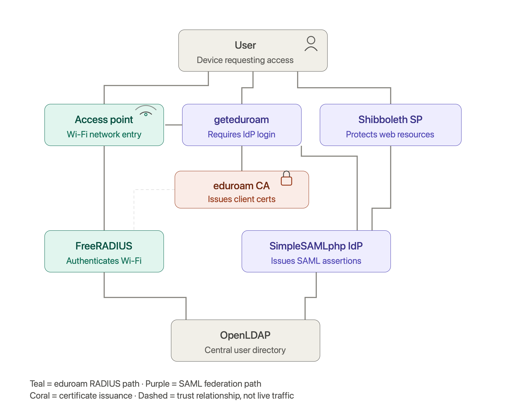

# fedops
This repository contains instructions for setting up different components of eduroam and federated identity management systems. A special thanks to the team at [IDEM](https://github.com/ConsortiumGARR/idem-tutorials/) for providing most of the content. The content has been adapted to fit the needs of the eduroam and federated identity management workshop organized by the UbuntuNet Alliance in Kampala, Uganda (August 17 - 21, 2026). We will use Ubuntu 24.04 LTS as the base operating system for all the components.

## Table of Contents
- [Install and Configure OpenLDAP for federated access](ldap/openldap-federated-access.md)
- [Install and Configure FreeRADIUS for eduroam](eduroam/freeradius-eduroam.md)
- [Install and Configure a SimpleSAMLphp IdP v2.x](federation/simplesamlphp-idp-v2.md)
- [Install and Configure a Shibboleth SP v3.x](federation/shibboleth-sp-v3.md)
- [Install and Configure geteduroam for federation/eduroam access](eduroam/geteduroam.md)

## Architecture Overview
The architecture consists of several components that work together to provide federated access and eduroam services. The main components include:
1. **OpenLDAP**: This is the directory service that stores user credentials and attributes.
2. **FreeRADIUS**: This is the RADIUS server that handles authentication requests for eduroam.
3. **SimpleSAMLphp IdP**: This is the Identity Provider that authenticates users and provides SAML assertions for federated access.
4. **Shibboleth SP**: This is the Service Provider that consumes SAML assertions from the IdP and provides access to protected resources.
5. **geteduroam**: This is a tool that simplifies the process of connecting to eduroam networks by automatically configuring the necessary settings on user devices.

